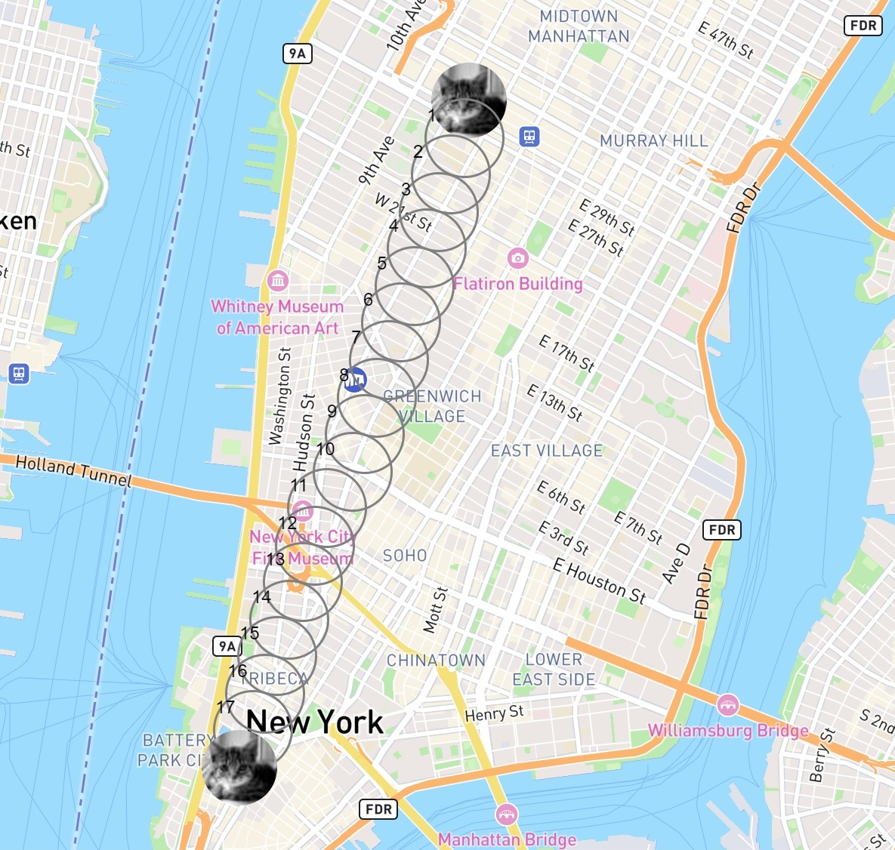

# RealtimeBusTracker

> Proyecto que mueve un marcador en un mapa de la ciudad de Nueva York
>> El botón "Go" se presiona para iniciar el movimiento del marcador
>>> El marcador recorre estaciones de bus en su trayecto a su destino final

---


---

<div align="center" id="top"> 
  
  &#xa0;
</div>

<h1 align="center">0109-RealTimeBusTracker</h1>

<p align="center">
  

  

  

  <!--  -->

</p>

<p align="center">
  <a href="#dart-acerca">Acerca</a> &#xa0; | &#xa0; 
  <a href="#sparkles-caracteristicas">Caracteristicas</a> &#xa0; | &#xa0;
  <a href="#rocket-tecnologias">Tecnologias</a> &#xa0; | &#xa0;
  <a href="#white_check_mark-requerimientos">Requerimientos</a> &#xa0; | &#xa0;
  <a href="#checkered_flag-instrucciones">Instrucciones</a> &#xa0; | &#xa0;
  <a href="#memo-licencia">Licencia</a> &#xa0; | &#xa0;
  <a href="https://github.com/betoje" target="_blank">Author</a>
</p>

<br>

## :dart: Acerca ##

Proyecto que mueve un marcador en un mapa de la ciudad de Nueva York, por las estaciones de bus en el trayecto entre Penn Station y el 911 Memorial. El marcador tiene la figura de uno o más gatos y va dejando una marca en las diferentes paradas con el número respectivo de parada.

## :sparkles: Caracteristicas ##

:heavy_check_mark: Mapa de la Ciudad de Nueva York\
:heavy_check_mark: Marcación con una figura que se obtiene de la página web https://placekitten.com

## :rocket: Tecnologias ##

Los siguientes lenguajes/herramientas fueron usados en este proyecto:

- JavaScript, HTML, CSS
- [mapbox](https://www.mapbox.com/)

## :white_check_mark: Requerimientos ##

Antes de empezar :checkered_flag:, se necesita tener [Git](https://git-scm.com) instalado.

## :checkered_flag: Instrucciones ##

```bash
# Clone este proyecto (desde la terminal)
$ git clone https://github.com/betoje/0109-RealtimeBusTracker

# Acceda al directorio
$ cd 0109-RealtimeBusTracker

# Arrastre el archivo index.html a su navegador de elección
```
## :memo: Licencia ##

Este proyecto está bajo la licencia de MIT. Para mayores detalles vea el archivo [LICENSE](LICENSE).

Hecho con el :heart: por <a href="https://github.com/betoje" target="_blank">Alberto Jacome</a>&#xa0;

<a href="#top">Regresar al inicio</a>
